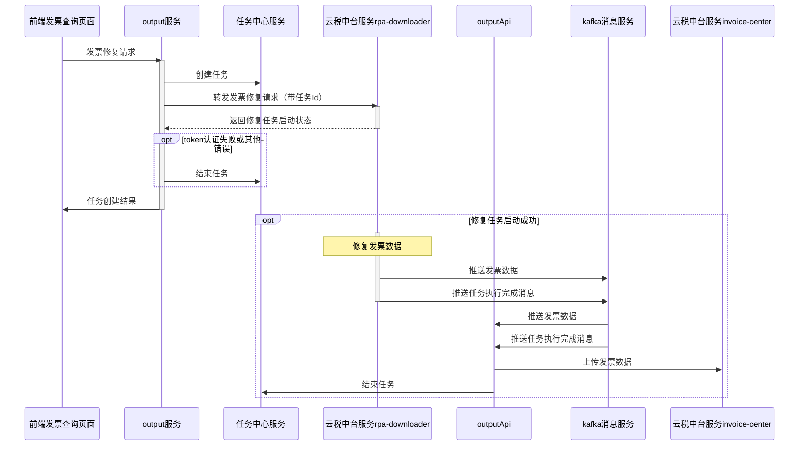

1

# md语法

baiwang.output.terminal.query(开票终端信息查询2.0)

## 图片

 

## 列表

1. a
2. b
3. c
- a
- b
- c
## 代码高亮

## 时序图

```mermaid
sequenceDiagram
     participant webPage as 前端发票查询页面
     participant output as output服务
     participant task as 任务中心服务 
     participant rpaDownloader as 云税中台服务rpa-downloader
     participant outputApi
     participant kafka as kafka消息服务
     participant invoiceCenter as 云税中台服务invoice-center
 webPage ->> output: 发票修复请求
 activate output
 output ->> task: 创建任务
 output ->> rpaDownloader: 转发发票修复请求（带任务Id）
 activate rpaDownloader
 rpaDownloader-->> output : 返回修复任务启动状态
 deactivate rpaDownloader
 opt token认证失败或其他错误
     output ->> task:结束任务
 end
 output ->> webPage: 任务创建结果
 deactivate output


 opt 修复任务启动成功
 activate rpaDownloader
 Note over rpaDownloader: 修复发票数据
 rpaDownloader->> kafka : 推送发票数据
 rpaDownloader->> kafka : 推送任务执行完成消息
 deactivate rpaDownloader
 kafka ->> outputApi: 推送发票数据
 kafka ->> outputApi: 推送任务执行完成消息
 outputApi ->> invoiceCenter : 上传发票数据
 outputApi ->> task : 结束任务

 end 
```
