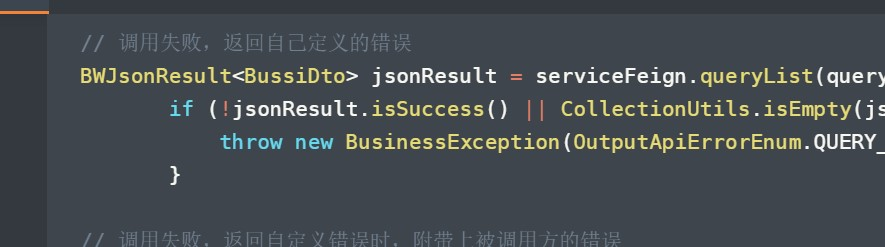

## 微服务

### 服务治理

1. 服务间调用报错，调用方应该定义自己的错误信息抛出去，这样可以让当前接口返回的错误种类可控（如果需要，可以将被调方返回的错误信息附加在自己定义的错误后面）
   
   ```java
    // 调用失败，返回自己定义的错误
    BWJsonResult<BussiDto> jsonResult = serviceFeign.queryList(queryStr);
           if (!jsonResult.isSuccess() || CollectionUtils.isEmpty(jsonResult.getData())) {
               throw new BusinessException(OutputApiErrorEnum.QUERY_LIST_ERROR);
           }
   
    // 调用失败，返回自定义错误时，附带上被调用方的错误
     BWJsonResult<BussiDto> jsonResult = serviceFeign.queryList(queryStr);
     if (!bwJsonResult.isSuccess() || CollectionUtils.isEmpty(bwJsonResult.getData())) {
               String detailMsg = com.baiwang.cloud.common.util.StringUtil.isEmpty(jsonResult .getErrorMsg()) ? "" : bwJsonResult.getErrorMsg();
               String errMsg = OutputApiErrorEnum.QUERY_RED_CONFRIM_INIT_ERROR.getMessage() + "详细原因：" + detailMsg;
               throw new BusinessException(OutputApiErrorEnum.QUERY_RED_CONFRIM_INIT_ERROR.getCodeAsString(), errMsg);
           }
   ```
   
   试想，如果调用的所有其他服务接口的错误信息，拿到后直接返回，错误种类数量就会爆炸，错误定位也会更困难。



### 日志记录

1. 微服务调用，第三方调用，入反参，必须写，以免如果有网络波动，双方扯皮

2. 记录有助于排查问题的日志

3. 不要记录大字段，如图片，二维码，text等字段，浪费磁盘，对排查问题无帮助，还会增加排查难度。

### 发版回滚技巧
如果有重要功能更新，影响比较大。可以通过配置，控制切换新旧逻辑。如果新功能有问题，可以通过修改配置，快速回滚功能。省去重新打包过程。
